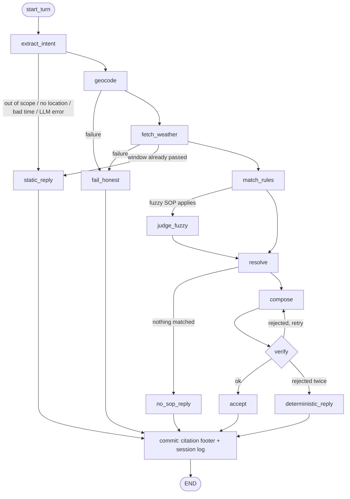

<div align="center">

# 🌦️ Weather-Advisory Support Bot

**Outdoor-safety answers from live weather data, grounded in written policy, never in model opinion.**


</div>

> Ask *"Is it safe to cycle in Bhopal today?"* The bot fetches the forecast, finds the matching
> **Standard Operating Procedure (SOP)**, and replies with guidance that **cites the SOP it came from**.
> If no SOP covers the question, it says so instead of guessing.

**Contents:** [Quick start](#-quick-start) · [How it works](#-how-it-works) · [SOPs](#-sops) · [Conflict rule](#-conflict-rule) · [Guarantees](#-where-each-guarantee-is-enforced) · [Memory](#-session-memory) · [Evals](#-evaluation-suite) · [Structure](#-project-structure)

---

## 🚀 Quick start

```bash
python -m venv .venv
source .venv/bin/activate          # Windows: .venv\Scripts\activate
pip install -r requirements.txt

cp .env.example .env               # then edit .env (git-ignored)
```

`.env` example (Groq):

```env
LLM_PROVIDER=groq                  # groq | openai | anthropic
LLM_MODEL=openai/gpt-oss-120b
GROQ_API_KEY=your_key_here
DEBUG=1                            # optional: show LLM error details in replies
```

| Command | What it does |
|---|---|
| `python -m app.check` | Tests your LLM config and prints the real error if it fails |
| `streamlit run frontend/streamlit_app.py` | Chat UI |
| `python -m app.cli` | Terminal chat (backend only) |
| `python -m evals.run_evals` | Eval suite, writes `evals/RESULTS.md` |
| `python -m evals.run_evals --fake-llm` | Wiring smoke test with a keyword stub (not a real result) |

Memory is per chat session (Streamlit tab / CLI run), in-process, and resets on restart.

---

## 🧭 How it works

The LLM does three narrow jobs: **extract** what the user asked, **classify** one fuzzy rubric, and **word** the reply.
It never creates, changes, or chooses safety guidance.



**Branches:** failure path · static/out-of-scope · no-SOP · fuzzy policy · compose/verify retry loop · deterministic fallback.
Every terminal path passes through `commit`, which adds the policy-basis footer and records the session decision log.

### Safety boundary

> **The LLM interprets language and can classify an explicitly defined fuzzy outcome, but it cannot create, modify, or independently choose the safety guidance.**

```text
User request → LLM intent extraction → live weather/location data → deterministic SOP matching
            → selected SOP + trusted evidence → LLM wording → verifier → cited response
```

---

## 📋 SOPs

Policies live in `policies/sops.yaml` (rules) and `policies/taxonomy.yaml` (allowed activities and groups).
**13 SOPs · 5 categories · severity `info` → `critical` · 1 fuzzy policy.**

*Why YAML: policy owners can edit rules without touching code, and every rule has an ID the reply can cite.*

| ID | Category | Severity | Applies to | Trigger (draft) |
|---|---|---|---|---|
| `SOP-SYS-01` | regional weather | 🔴 critical | any activity | daily rain ≥ 64.5 mm |
| `SOP-STORM-01` | regional weather | 🟠 high | any activity | thunderstorm weather code in window |
| `SOP-RAIN-01` | regional weather | 🟡 moderate | any activity | daily rain 15.6 – 64.4 mm |
| `SOP-WIND-01` | outdoor exercise | 🟠 high | cycling, two-wheeler | gusts ≥ 50 km/h |
| `SOP-WIND-02` | outdoor exercise | 🟡 moderate | cycling, two-wheeler | gusts 35 – 49 km/h |
| `SOP-HEAT-01` | outdoor exercise | 🟠 high | running, cycling, hiking, sports | feels-like ≥ 41 °C (10am–5pm) |
| `SOP-UV-01` | outdoor exercise | 🟡 moderate | exercise, play, picnic | UV ≥ 8 (11am–4pm) |
| `SOP-HEAT-02` | vulnerable groups | 🟠 high | children, elderly, pets | feels-like ≥ 36 °C (10am–5pm) |
| `SOP-COLD-01` | vulnerable groups | 🟡 moderate | children, elderly | feels-like ≤ 8 °C |
| `SOP-KIDS-01` | vulnerable groups | 🟢 low | children's outdoor play | rain chance ≥ 50% |
| `SOP-TRAVEL-01` | travel | 🟡 moderate | commuting, driving | rain chance ≥ 70% |
| `SOP-TRAVEL-02` | travel | 🟠 high | driving, riding, commuting | visibility ≤ 1000 m |
| `SOP-PICNIC-01` | leisure (fuzzy) | ⚪ info → 🟡 moderate | picnic | rubric: good / mixed / poor |

Adding a rule = append valid YAML. The loader picks it up on the **next message** (eval `D1` demonstrates this).

### 🌧️ The rain-system case

`SOP-SYS-01` is a **critical** catch-all. Open-Meteo has no IMD bulletins, so it derives severe rain from the forecast's daily total:
`daily precipitation ≥ 64.5 mm` (the IMD heavy-rain lower bound). Because it applies to every activity and is critical,
it outranks activity-specific rules and the reply must lead with the rain situation.

> ⚠️ **Known gap:** a real IMD low-pressure alert that the Open-Meteo forecast doesn't reflect can be missed.

### 🧩 The fuzzy policy

`SOP-PICNIC-01` uses a human-written rubric instead of a number. The LLM may only pick one of the pre-written outcomes
(`good`, `mixed`, `poor`), each with fixed guidance and severity. Anything else is discarded. The LLM makes the
classification, but never authors the guidance.

> ⚠️ **Thresholds are drafts.** They are not medically or legally approved; policy owners must review them before real use.

---

## ⚖️ Conflict rule

When several SOPs match, they are ranked by:

1. **Severity** (highest first)
2. **Specificity**: for equal severity, a rule written for this activity/group beats a catch-all
3. **ID** as the final tie-break

The top SOP is the **primary** and leads the reply. Up to `max_secondary` (default 2, set in the YAML) more appear as "Also".
All selected SOPs are cited in the footer.

*Rationale: the highest-risk message must never be buried, but users should still see other hazards that independently apply.*

**Limitation:** the system does not detect whether a lower-priority SOP's advice contradicts the primary.

---

## 🛡️ Where each guarantee is enforced

| Guarantee | Enforced by |
|---|---|
| **Traceable to an SOP** (or says none applies) | `commit` node appends the "Policy basis" footer in code, not via the model |
| **Policy changes need no code changes** | `app/policies.py` is generic; the fetcher requests whatever metrics the SOPs reference; the loader hot-reloads |
| **No forecast it doesn't have** | `geocode` / `fetch_weather` failures route to `fail_honest` (fixed text, no weather numbers) |
| **No invented generic advice** | `no_sop_reply` and `static_reply` are fixed text; no LLM involved |
| **Model doesn't decide facts** | `app/verify.py` checks every number comes from SOP evidence/guidance and only selected SOP IDs are cited; failures retry, then fall back to verbatim SOP text |
| **Prompt-injection resistance** | The composer and fuzzy judge never receive the raw user message. Extraction is schema-constrained (activities limited to taxonomy IDs), so user text can only influence *which* SOP matches, not what it says |

**Honest limits of live policy editing:** a new metric must be a valid Open-Meteo variable name. A new operator, a
non-Open-Meteo data source, or a new aggregation needs code. Invalid SOPs are skipped and recorded in `PolicySet.errors`,
so check after editing.

---

## 🧠 Session memory

Per session, the bot keeps a structured `decision_log` (location, day/period, activities, groups, SOP IDs, severity for each
answered turn) plus recent raw messages for resolving references.

```text
You: Is it safe to cycle in Bhopal today?
Bot: ...
You: What about this evening?     ← inherits Bhopal + cycling, changes the time window
```

The composer sees the last three log entries so answers stay consistent within the session.

---

## ✅ Evaluation suite

```bash
python -m evals.run_evals      # writes evals/RESULTS.md
```

| Area | Cases |
|---|---|
| SOP clearly applies | `A1`, `A2` |
| Paraphrased intent (no SOP keywords) | `P1`, `P2` |
| Severe rain | `S1` (live), `S1b` (synthetic fixture) |
| No SOP applies | `N1`–`N3` |
| Failure handling | `F1` API down, `F2` location unresolved |
| Adversarial | `ADV1` injection, `ADV2` fake policy, `ADV3` verifier |
| Session memory | `M1` |
| Conflict ranking | `C1` |
| Fuzzy policy | `FZ1` |
| Live policy edit | `D1` |

**Time robustness.** `S1` uses live data and **SKIPs, never silently passes,** when no probe city currently has heavy rain.
`S1b` uses a clearly synthetic severe-rain fixture so the rain-system policy stays tested after real events pass. Treat
live-data cases as non-gating smoke tests; fixtures give the stable regression coverage.

**Status.** My build sandbox had no real LLM or live Open-Meteo access, so `evals/RESULTS_stub_smoketest.md` is only a wiring
check with a keyword stub. Run the suite with your real LLM and check **P1/P2** (paraphrase mapping), **FZ1** (fuzzy
classification), and how often the verifier forces a verbatim fallback (safe, but less conversational).

---

## 🗂️ Project structure

```text
app/
  graph.py        # LangGraph orchestration (all nodes and routing)
  policies.py     # Policy loading, validation, condition evaluation, ranking
  weather.py      # Open-Meteo geocoding + forecast client
  llm.py          # Provider-agnostic LLM wrapper (Groq / OpenAI / Anthropic)
  verify.py       # Grounding checks on model-written text
  cli.py          # Terminal chat
  check.py        # LLM config diagnostic

policies/
  sops.yaml       # The SOPs (data)
  taxonomy.yaml   # Allowed activities and groups

frontend/
  streamlit_app.py

evals/
  run_evals.py    # Eval suite
  fixtures.py     # Synthetic weather for deterministic tests
  fake_llm.py     # Keyword stub for wiring tests only
```
